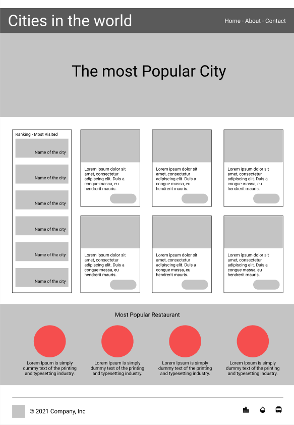

# Cities in the world

- **Desplegada en Github Pages** : [Cities in the world](https://devdesiree.github.io/F5-Cities-in-the-world/)
---

## Descripción
 Se desarrolla una web estática haciendo uso de HTML, CSS y Bootstrap a partir de un Wireframe.

## Imágenes

### Wireframe:

### Diseño Final:

## Tecnologías Utilizadas

- HTML5
- CSS3
- Bootstrap

## Configuración del Proyecto

1. Clona este repositorio: `git clone https://github.com/DevDesiree/F5-Cities-in-the-world.git`

    - O descárgatelo, desde el botón Code -> Download ZIP.

2. Abre el archivo index.html en tu navegador web.

3. ¡Listo! Puedes comenzar a explorar el proyecto.

## 👩‍💻 Autora
*Desiree Sánchez*
